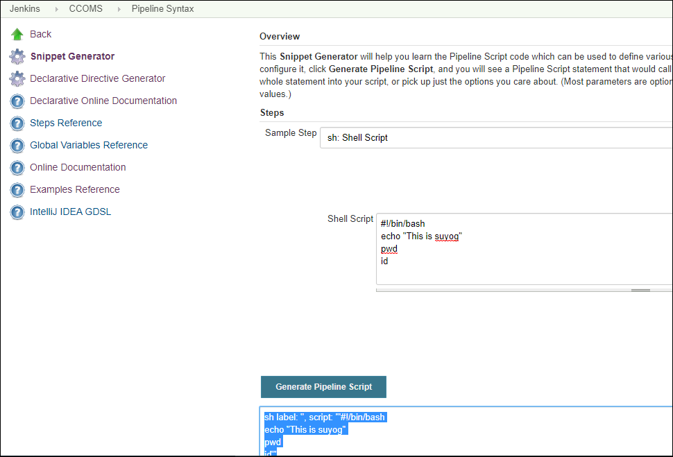

Devops and Jenkins 
================


Table of contents
=================

<!--ts-->
   * [Devops](#devops)
   * [How to start working in devops](#how-to-start-working-in-devops)
   * [Jenkins](#jenkins)
      * [Declarative vs scripted](#declarative-vs-scripted)
      * [Resuming build from failed stage](#resuming-build-from-failed-stage)
      * [Backup and Restoration](#backup-and-restoration)
   * [Monolithic vs Microservice](#monolithic-vs-microservice )
   * [Working with Docker Private Registry](#working-with-docker-private-registry)
   * [Roles and Responsibilities of Devops Engg](#roles-and-responsibilities-of-devops-engg)
   * [Roles and Responsibilities of Cloud Engg](#roles-and-responsibilities-of-cloud-engg)
   * [Best Practices for Devops](#best-practices-for-devops)
   * [Best practices for Jenkins](#best-practices-for-jenkins)
<!--te-->

Devops
==============
Devops is a collection architecture, tools that increases organization ability to deliver applications and services at rapid pace

Devops lifecycle
----------------


How to start working in devops
==============================
You should have proper understanding of how below things implemented manually.
- How projects get build ?
- How Central code repository is managed for multiple teams.(git workflow strategies) ?
- How unit testing is helpful to test individual module ?

Jenkins
=======

Declarative vs Scripted
-----------------------

**declarative:** must be enclosed within a pipeline {} block 

**scripted:** always are enclosed within a node {} block

We can make best use of plugins using jenkin pipelines. Pipeline contains sequence of stages to perform some task. </br>

Feature of pipeline. </br>
* Code: Pipelines are implemented in code and typically checked into source control, giving teams the ability to edit, review, and iterate upon their delivery pipeline.
* Durable: Pipelines can survive both planned and unplanned restarts of the Jenkins master.
* Pausable: Pipelines can optionally stop and wait for human input or approval before continuing the Pipeline run.
* Versatile: Pipelines support complex real-world CD requirements, including the ability to fork/join, loop, and perform work in parallel.
* Extensible: The Pipeline plugin supports custom extensions to its DSL [1] and multiple options for integration with other plugins.
 

Declarative
----------
- Most recent feature, which provides reacher syntax over scripted pipeline </br>
- Easy for readers and easy for writing a stages. For witting 'steps/snippet and declaratives' you dont need syntax knowledge of pipeline. </br>
Code/snippet generator feature is available on jenkins itself, we can use this feature to develop a pipeline. </br>


pipeline,stages,agent - are the declarative</br>
steps - we write code </br>

Scripted.
---------
Pipeline’s work inside of a node block does two things:
* Schedules the steps contained within the block to run by adding an item to the Jenkins queue. As soon as an executor is free on a node, the steps will run. </br>
* Creates a workspace (a directory specific to that particular Pipeline) where work can be done on files checked out from source control. </br>


Implementation
==============

Workflow of jenkins pipeline 
---------------------------
<p align="center"></p>


MultiBranch-pipeline Project
----------------------
This will allows you to automatically create a pipeline for each branch on your source control repository. </br>
See below Jenkins MultiBranchPipeline Screenshot.</br>
<p align="center"></p>


Multibranch pipeline works using a Jenkinsfile, that is stored along with your source code inside a version control repository.</br>
A Jenkinsfile is nothing but a pipeline script that defines your CI pipeline.</br>

```groovy
pipeline {

    agent {
        label 'master'
    }
    tools {
        maven 'maven'
        jdk 'jdk8'
    }

    libraries {
        lib('git_infoshared_lib@master')
    }

    environment {

        APP_NAME = "ccoms"
        APP_ROOT_DIR = "org-mgmt-system"
        APP_AUTHOR = "Suyog Chinche"

        GIT_URL="https://github.com/svchinche/CCOMS.git"

        VERSION_NUMBER=VersionNumber([
            versionNumberString :'${BUILD_MONTH}.${BUILDS_TODAY}.${REVISION_IDBER}',
            projectStartDate : '2019-02-09',
            versionPrefix : 'v'
        ])

        SBT_OPTS='-Xmx1024m -Xms512m'
        JAVA_OPTS='-Xmx1024m -Xms512m'

    }


    stages {

        stage('Cleaning Phase') {
            steps {
                 /* This block used here since VERSION_NUMBER env var is not initialize and we were initializing this value through shared library  */
                script {
                    env.REVISION_ID = getBuildVersion()
                }
                sh 'mvn -f ${APP_ROOT_DIR}/pom.xml -Drevision="${REVISION_ID}" clean:clean'
            }
        }

        stage('Copy Resources') {
            steps {
                sh 'mvn -f ${APP_ROOT_DIR}/pom.xml -Drevision="${REVISION_ID}" resources:resources  resources:testResources'
            }
        }

        stage('Generate Test Cases - Surefire') {
            steps {
                sh 'mvn -f ${APP_ROOT_DIR}/pom.xml -Drevision="${REVISION_ID}" compiler:compile  compiler:testCompile surefire:test'
            }

            post {
                success {
                    publishHTML([allowMissing: false, alwaysLinkToLastBuild: true, keepAll: true, reportDir: '${APP_ROOT_DIR}/config-service/target/surefire-reports', reportFiles: '*.xml', reportName: 'Unit Test Report', reportTitles: 'Unit Test Result'])
                }
            }
        }

        stage('Publishing code on SONARQUBE'){
            when {
                anyOf {
                    branch 'release'
                }
            }
            steps {
                sh 'mvn -f ${APP_ROOT_DIR}/pom.xml -Drevision="${REVISION_ID}" -pl .,config-service  sonar:sonar'
            }
        }


        stage('Packaging') {
            steps {
                sh 'mvn -f ${APP_ROOT_DIR}/pom.xml -Drevision="${REVISION_ID}" -pl department-service,employee-service,gateway-service,organization-service war:war spring-boot:repackage dependency:unpack@unpack'
            }
        }

```


Resuming build from failed stage
--------------------------------
One more, benefit of using Jenkins is that, You can continue from past failed stage, Use repay feature of jenkins as shown below.
<p align="center"></p>


Backup and Restoration of jenkins
------
Use backup plugin to take a backup.
* Click on Manage Jenkins and choose the ‘Manage Plugins’ option.
* Now when you go to Manage Jenkins, and scroll down you will see ‘Backup Manager’ as an option. Click on this option. and then setup
* here, the main field to define is the directory for your backup. Ensure it’s on another drive which is different from the drive where your Jenkins instance is setup. Click on the Save button.
* Click on the ‘Backup Hudson configuration’ from the Backup manager screen to initiate the backup.
* To recover from a backup, go to the Backup Manager screen, click on Restore Hudson configuration.
* The list of backup’s will be shown, click on the appropriate one to click on Launch Restore to begin the restoration of the backup.


Monolithic vs Microservice 
==========================

* Difference between monolithic and microservice based application
    * Monolythic application 
        - All the code resides in one big app and separate database is used to store database. 
        - At the end of the day all one big program does your work
        - Easy when your team and project is small, what if your project grows.

    * Microservice based application 
        - Microservices are Awesomesome
        - Agility
        - Speedy deployment

    * Disadvantages of microservices 
        - Microservice make terribe to analyze the issue 

Working with Docker Private Registry
=======================

* Create a certificate

``` openssl req -newkey rsa:4096 -nodes -sha256 -keyout /etc/certs/ca.key -x509 -days 365 -out /etc/certs/ca.crt ```

* Create docker registry container 

``` docker run -d -p 5000:5000 --restart=always --name registry -v /etc/certs:/etc/certs  -v /root/docker_registry/images:/var/lib/registry -e REGISTRY_HTTP_TLS_CERTIFICATE=/etc/certs/ca.crt -e REGISTRY_HTTP_TLS_KEY=/etc/certs/ca.key registry ```

* Docker logs registry ---> check if any errors
  remove registry container if there are any issue while starting
``` docker stop $(docker ps -aqf "ancestor=registry"); docker rm $(docker ps -aqf "ancestor=registry") ```

* Tag all images which you want to push to docker registry 
```docker tag eureka-server:0.1 k8s-master:5000/eureka-server:0.1 ```
``` docker tag eureka-cnts-svc:0.1 k8s-master:5000/eureka-cnts-svc:0.1 ```
``` docker tag eureka-capitals-svc:0.1  k8s-master:5000/eureka-capitals-svc:0.1 ```

* Push docker images 
```
docker push k8s-master:5000/eureka-server:0.1
docker push k8s-master:5000/eureka-cnts-svc:0.1
docker push k8s-master:5000/eureka-capitals-svc:0.1
```

* Client node: 
Copy certificate and run this command on client node
``` scp -pr root@k8s-master:/etc/certs/ca.crt /etc/docker/certs.d/k8s-master:5000/ ```

How to start working in devops
==============================

Roles and Responsibilites of Devops Engg
=======================================

Roles and Responsibilities of Cloud Engg
========================================

Best Practices for Devops
=======================

Best practices for Jenkins
==========================
