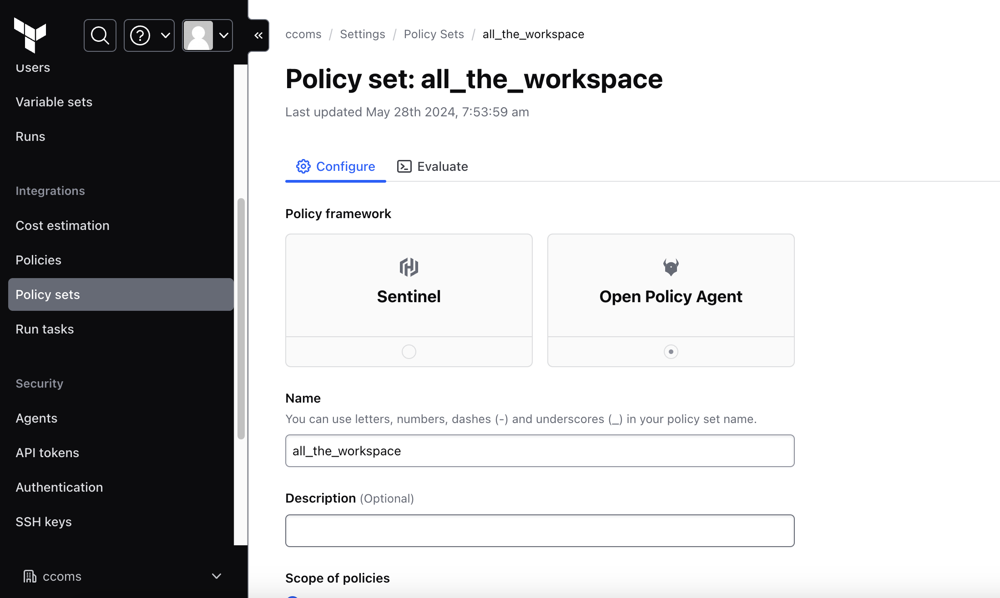
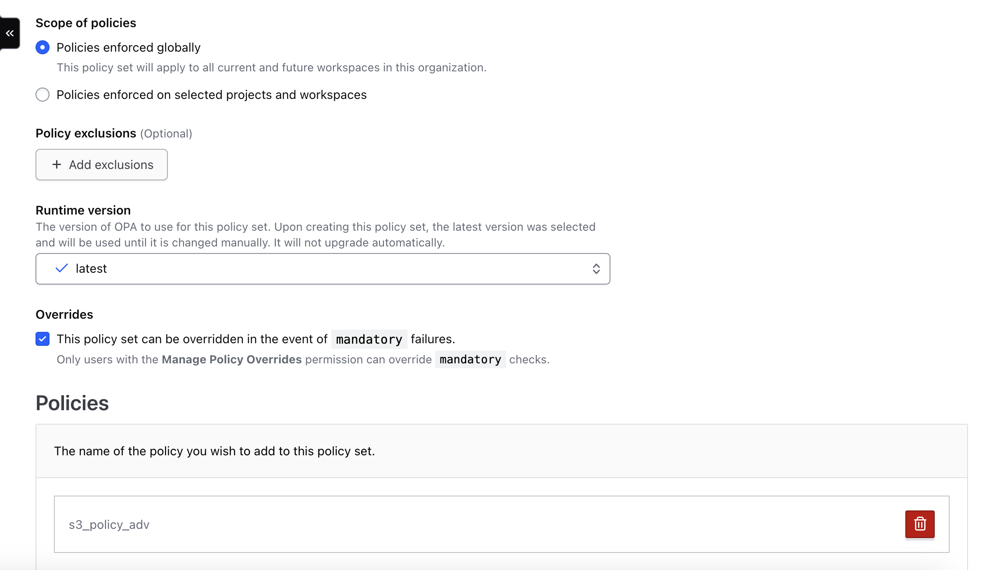
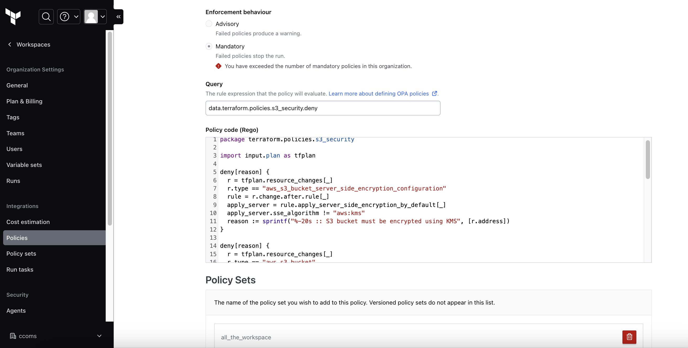

# Evaluationg OPA in CLI and in Terraform Cloud

AWS S3 Terraform Resource with OPA Policy Enforcement
This project demonstrates the use of Terraform to manage AWS S3 resources, along with Open Policy Agent (OPA) to enforce security policies on the Terraform plan. The policies ensure that no S3 buckets are created with public access, without encryption, or without versioning.

## CLI commands
```sh
terraform plan --out tfplan.binary && terraform show -json tfplan.binary > tfplan.json

## this temparary fix to generate plan file which is compatible for opa command and for TFC
terraform show -json tfplan.binary | jq '{plan: .}' > tfplan.json

opa exec --decision terraform/policies/s3_security/deny --bundle policy tfplan.json
{
  "result": [
    {
      "path": "input_plan.json",
      "result": [
        "aws_s3_bucket.s3_bucket :: S3 bucket should have Product and Name tags",
        "aws_s3_bucket_public_access_block.s3_bucket_public_access_block :: S3 buckets all public should be blocked",
        "aws_s3_bucket_server_side_encryption_configuration.s3_bucket_server_side_encryption_configuration :: S3 bucket must be encrypted using KMS",
        "aws_s3_bucket_versioning.s3_version :: S3 buckets versioning must be Enabled"
      ]
    }
  ]
}
```

## Configure Terraform Cloud + Module

Add organization details in providers.tf file

```sh
terraform {
  required_version = "=1.7.5"
  required_providers {
    aws = {
      source  = "hashicorp/aws"
    }
  }
 cloud {
   organization = "ccoms"
   workspaces {
     name = "my_workspace"
   }
 }
}

provider "aws" {
  region = "us-east-1"
}
```

Setup Terraform Cloud.
1. Create Organization, if not available
2. Create Workspace, if not created.
3. Configure env variables as show below
4. Run terraform init on CLI 
5. Run terraform plan
6. Check output in CLI and in terraform Cloud

### Configure env variables
<p align="center"></p>

### Run terraform init on CLI
```sh
terraform init -upgrade
```

### Run terraform plan from CLI
<p align="center"></p>

### Check output in CLI and in terraform Cloud
<p align="center"></p>

### Setting Up Policy on terraform Cloud
1. Create policy set as below
Description - Policy sets are collections of policies you can apply globally or to specific projects and workspaces in your organization
<p align="center"></p>
<p align="center"></p>

2. Create policy as below
Description - This is required to create a policy and attach it to policy set
<p align="center"></p>
<p align="center"></p>

3. Run and verify the policies
<p align="center"></p>
<p align="center"></p>